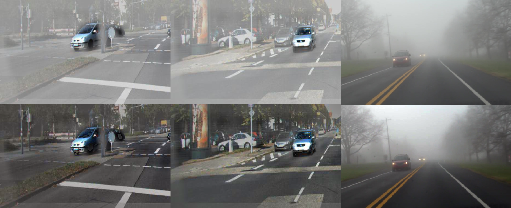
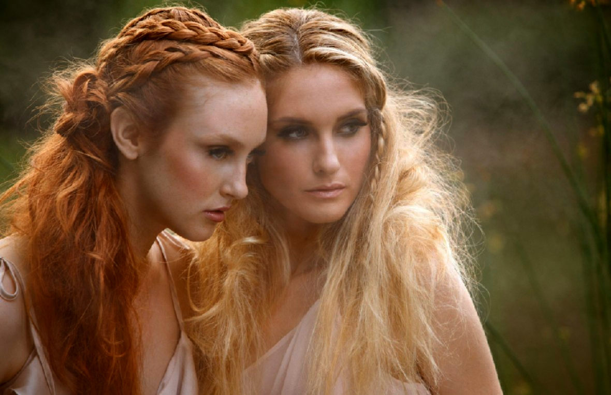

# Dehazing With Neural Networks

This is the final trained model used for dehazing images in our paper published in Pattern Recognition Letters November 2019. 

https://www.sciencedirect.com/science/article/abs/pii/S0167865519302235


```python
#Run demo on images in /data directory
python finalTesting_onestep_upscale.py
```

## Demo:



## Demo:


